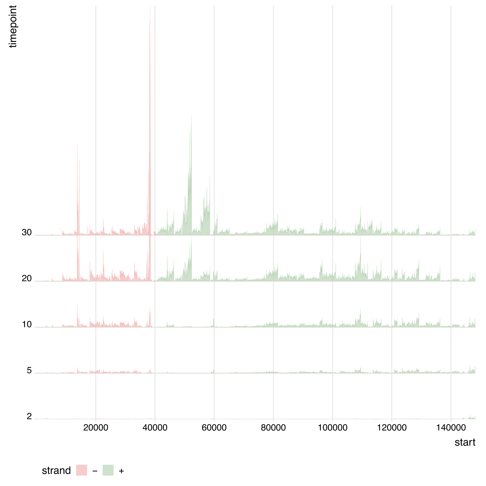

# Reproducible data analysis of Finstrlová et al. (2022)

All the libraries are loaded in the `deseq_processing.R` script
including the `tidyverse`, `DESeq2` and `CompleHeatmap` libraries.

``` r
source("scripts/deseq_processing.R")
```

## Genome Annotation

``` bash
pharokka.py -i phageK-NC.fasta -o phanotate-annotation -p phanotate-phageK-NC -g phanotate -d pharokka-db/ -t 8
```

## Mapping

### Downloading data

Data was downloaded from the SRA explorer page using a given list of
`curl` lines as in the `data-links.sh` script.

### Trimming with Trimmomatic

Quality filtering and trimming was done using
[trimmomatic](https://github.com/usadellab/Trimmomatic)

``` bash
function trimming() {
    trimmomatic SE -threads 8\
    $1\
    Trimmed-${1}\
    ILLUMINACLIP:TruSeq3-SE:2:30:10\
    SLIDINGWINDOW:4:15\
    LEADING:22\
    TRAILING:22\
    MINLEN:20\
    AVGQUAL:22
}
```

``` bash
for i in SRR*gz; 
    do trimming $i; 
done
```

### Map alignment with STAR

``` bash
STAR --runMode genomeGenerate\
    --runThreadN 32\
    --genomeDir $GENOME_DIR\
    --genomeFastaFiles $GENOME_FASTA\
    --genomeSAindexNbases 7\
    
STAR --runMode alignReads\
    --runThreadN 32\
    --genomeDir $GENOME_DIR\
    --readFilesManifest $READS_MANIFEST\
    --readFilesCommand gunzip -c\
    --readFilesPrefix $READS_PREFIX\
    --outFilterMultimapScoreRange 0\
    --outFilterMatchNmin 30\
    --outFilterMatchNminOverLread 0.95\
    --outFilterMismatchNoverLmax 0.02\
    --outFilterMismatchNoverReadLmax 1\
    --alignIntronMin 20\
    --alignIntronMax 1\
    --outSAMtype BAM SortedByCoordinate\
    --limitBAMsortRAM 1096346262\
    --outBAMcompression 10\
    --bamRemoveDuplicatesType UniqueIdentical\
    --outSAMattributes NH HI AS nM RG\
    
samtools index Aligned.sortedByCoord.out.bam
```

## Counting expression

### Counting expression for the coverage analysis

We first split the alignment by the names of the grouped reads id
(joining all replicates per group) from the manifest.

``` bash
samtools split -f %! ungrouped-mapping/grouped-mapping.out.bam
```

Later we generate the coverage data for each of the time points of the
infection on the forward and reverse strand[^1]:

``` bash
for i in {2,5,10,20,30}; 
do mosdepth -t 8 -f phageK-NC.fasta -R Newman-min${i} forward-newman-min-${i} -F 1812 grouped-mapping.out.bam; done

for i in {2,5,10,20,30}; 
do mosdepth -t 8 -f phageK-NC.fasta -R Newman-min${i} reverse-newman-min-${i} -i 16 grouped-mapping.out.bam; done
```

### Counting expression for the DE analysis

We first split the alignment by the names of the ungrouped reads id from
the manifest.

``` bash
samtools split -f %! ungrouped-mapping/ungrouped-mapping.out.bam
```

Then using `BamToCount` with each of the annotation files will generate
a counts per library.

``` bash
for i in *; 
do bamtocounts -r phageK-NC.fasta --coords -n --header <annotation>.gff3 ${i} > ${i}.tsv; 
done
```

## Coverage analysis

``` r
forwardfiles <- dir_ls(path = "grouped-mapping/mosdepth-counts-forward/", regexp = "*.gz$")

reversefiles <- dir_ls(path = "grouped-mapping/mosdepth-counts-reverse/", regexp = "*.gz$")

forward <- forwardfiles |>
  map_df(bed_read, .id = "filename") |>
  as_tibble() |>
  mutate(filename = as.factor(filename), strand = '-')

reverse <- reversefiles |>
  map_df(bed_read, .id = "filename") |>
  as_tibble() |>
  mutate(filename = as.factor(filename), strand = '+')
  
data <- rbind(reverse, forward) |> 
  mutate(
    timepoint = as.factor(str_extract(filename, "\\d+"))
  ) |> 
  mutate(timepoint = fct_relevel(timepoint, c('2','5','10','20','30'))) |>
  filter(coverage != 0) |> 
  mutate(sqrt_cov = sqrt(coverage))

data
```

    # A tibble: 680,966 × 8
       filename                 chr   start   end coverage strand timepoint sqrt_cov
       <fct>                    <chr> <int> <int>    <int> <chr>  <fct>        <dbl>
     1 grouped-mapping/mosdept… NC_0…    52    56        1 +      10            1   
     2 grouped-mapping/mosdept… NC_0…    56    60        2 +      10            1.41
     3 grouped-mapping/mosdept… NC_0…    60    61        8 +      10            2.83
     4 grouped-mapping/mosdept… NC_0…    61    62       32 +      10            5.66
     5 grouped-mapping/mosdept… NC_0…    62    63       51 +      10            7.14
     6 grouped-mapping/mosdept… NC_0…    63    64       52 +      10            7.21
     7 grouped-mapping/mosdept… NC_0…    64   100       54 +      10            7.35
     8 grouped-mapping/mosdept… NC_0…   100   113       55 +      10            7.42
     9 grouped-mapping/mosdept… NC_0…   113   127       57 +      10            7.55
    10 grouped-mapping/mosdept… NC_0…   127   130       56 +      10            7.48
    # ℹ 680,956 more rows

``` r
ggplot(data, aes(x = start, y = timepoint, height = coverage)) +
  geom_density_ridges(aes(fill = strand, color = strand),
    stat = "identity",
    scale = 5,
    alpha = .7,
    size = .1
  ) +
  scale_y_discrete(expand = c(0, 0)) +
  scale_x_continuous(expand = c(0, 0), breaks = c(0, 20000, 40000, 60000, 80000, 100000, 120000, 140000)) +
  theme_ridges() +
  theme(legend.position = "bottom") +
  scale_fill_manual(values = c("#F4B6B7", "#BAD4B7")) +
  scale_color_manual(values = c("#F4B6B7", "#BAD4B7"))
```


``` r
ggsave("figs/ridges-perbase.pdf", width = 9, height = 9, dpi = 200)
```



## Differential gene expression analyses

### NCBI annotation

Generate the expression data file from all file counts

``` r
process_expression_data
```

    function (folder_path, output_file_path) 
    {
        expressionfiles <- dir_ls(path = folder_path, regexp = "*.tsv$")
        expressionData <- pivot_wider(mutate(select(dplyr::rename(mutate(as_tibble(map_df(expressionfiles, 
            read_tsv, .id = "filename")), Filename = as.factor(filename), 
            Sample = as.factor(str_extract(filename, "Newman.+(?=\\.bam)")), 
            ), Gene = `#Feature`), Sample, Counts, Gene), Gene = str_replace(Gene, 
            "cds-|UAKGERNU_", "")), names_from = Sample, values_from = Counts)
        write_tsv(expressionData, file = output_file_path)
        return(expressionData)
    }

``` r
process_expression_data(folder_path = "ungrouped-mapping/ncbi-mapping/", output_file_path = "ungrouped-mapping/ncbi-phageK-expression.tsv")
```

    # A tibble: 233 × 19
       Gene           `Newman-control-R01` `Newman-control-R02` `Newman-control-R03`
       <chr>                         <dbl>                <dbl>                <dbl>
     1 YP_009041223.1                    0                    0                    0
     2 YP_009041224.1                    0                    0                    0
     3 YP_009041225.1                    0                    0                    0
     4 YP_009041226.1                    0                    0                    0
     5 YP_009041227.1                    0                    0                    0
     6 YP_009041228.1                    1                    0                    0
     7 YP_009041229.1                    0                    0                    0
     8 YP_009041230.1                    0                    0                    0
     9 YP_009041231.1                    1                    0                    0
    10 YP_009041232.1                    0                    0                    0
    # ℹ 223 more rows
    # ℹ 15 more variables: `Newman-min10-R01` <dbl>, `Newman-min10-R02` <dbl>,
    #   `Newman-min10-R03` <dbl>, `Newman-min2-R01` <dbl>, `Newman-min2-R02` <dbl>,
    #   `Newman-min2-R03` <dbl>, `Newman-min20-R01` <dbl>,
    #   `Newman-min20-R02` <dbl>, `Newman-min20-R03` <dbl>,
    #   `Newman-min30-R01` <dbl>, `Newman-min30-R02` <dbl>,
    #   `Newman-min30-R03` <dbl>, `Newman-min5-R01` <dbl>, …

then process all files to get the DESeq2 object

``` r
process_dds
```

    function (metadata_file_path, expression_file_path) 
    {
        metadata <- read.table(metadata_file_path, sep = "\t", header = T, 
            row.names = 1)
        expressionData <- read.table(expression_file_path, sep = "\t", 
            header = T, row.names = 1, check.names = F)
        expressionDataOrdered <- select(expressionData, "Newman-control-R01", 
            "Newman-control-R02", "Newman-control-R03", "Newman-min2-R01", 
            "Newman-min2-R02", "Newman-min2-R03", "Newman-min5-R01", 
            "Newman-min5-R02", "Newman-min5-R03", "Newman-min10-R01", 
            "Newman-min10-R02", "Newman-min10-R03", "Newman-min20-R01", 
            "Newman-min20-R02", "Newman-min20-R03", "Newman-min30-R01", 
            "Newman-min30-R02", "Newman-min30-R03")
        all(colnames(expressionData) == rownames(metadata))
        expValues <- data.matrix(expressionDataOrdered)
        expValuesInteger <- round(expValues)
        ddsObject <- DESeqDataSetFromMatrix(countData = expValuesInteger, 
            colData = metadata, design = ~time)
        dds <- DESeq(ddsObject)
        return(dds)
    }

``` r
ncbiDds <-  process_dds(metadata_file_path = "ungrouped-mapping/mapping-metadata.tsv", expression_file_path = "ungrouped-mapping/ncbi-phageK-expression.tsv")
```

Generate the expression matrix for the heatmap:

``` r
get_fold_change_matrix
```

    function (dds) 
    {
        time_M2_vs_C <- lfcShrink(dds, coef = "time_M2_vs_C", type = "normal", 
            lfcThreshold = 1)
        time_M5_vs_C <- lfcShrink(dds, coef = "time_M5_vs_C", type = "normal", 
            lfcThreshold = 1)
        time_M10_vs_C <- lfcShrink(dds, coef = "time_M10_vs_C", type = "normal", 
            lfcThreshold = 1)
        time_M20_vs_C <- lfcShrink(dds, coef = "time_M20_vs_C", type = "normal", 
            lfcThreshold = 1)
        time_M30_vs_C <- lfcShrink(dds, coef = "time_M30_vs_C", type = "normal", 
            lfcThreshold = 1)
        M2 <- pivot_longer(mutate(as_tibble(time_M2_vs_C, rownames = "gene"), 
            sample = "M2"), cols = !c(gene, sample), names_to = "parameter", 
            values_to = "value")
        M5 <- pivot_longer(mutate(as_tibble(time_M5_vs_C, rownames = "gene"), 
            sample = "M5"), cols = !c(gene, sample), names_to = "parameter", 
            values_to = "value")
        M10 <- pivot_longer(mutate(as_tibble(time_M10_vs_C, rownames = "gene"), 
            sample = "M10"), cols = !c(gene, sample), names_to = "parameter", 
            values_to = "value")
        M20 <- pivot_longer(mutate(as_tibble(time_M20_vs_C, rownames = "gene"), 
            sample = "M20"), cols = !c(gene, sample), names_to = "parameter", 
            values_to = "value")
        M30 <- pivot_longer(mutate(as_tibble(time_M30_vs_C, rownames = "gene"), 
            sample = "M30"), cols = !c(gene, sample), names_to = "parameter", 
            values_to = "value")
        foldChangeData <- pivot_wider(select(filter(rbind(M2, M5, 
            M10, M20, M30), parameter == "log2FoldChange"), gene, 
            sample, value), names_from = sample, values_from = value)
        foldChangeMatrix <- as.matrix(foldChangeData[, -1])
        rownames(foldChangeMatrix) <- foldChangeData$gene
        return(foldChangeMatrix)
    }

``` r
ncbiFoldChangeMatrix <- get_fold_change_matrix(ncbiDds)
```

Using the `ComplexHeatmap` library we will create a circular heatmap:

``` r
circular_heatmap
```

    function (foldChangeMatrix, output_file) 
    {
        circos.clear()
        hc <- hclust(dist(foldChangeMatrix), method = "complete")
        circos.par(start.degree = 90, gap.degree = 3)
        pdf(output_file, width = 10, height = 10)
        col_fun1 <- colorRamp2(c(-5, 0, 10), c("#467CBC", "#F8F7CE", 
            "#D22729"))
        lgd <- Legend(title = "Expression", col_fun = col_fun1)
        circos.heatmap(foldChangeMatrix, col = col_fun1, split = 3, 
            show.sector.labels = TRUE, rownames.side = "outside", 
            dend.side = "inside", order(as.numeric(gsub("M", "", 
                colnames(foldChangeMatrix)))), dend.callback = function(dend, 
                m, si) {
                dendsort(dend)
            }, track.height = 0.2)
        grid.draw(lgd)
        dev.off()
    }

``` r
circular_heatmap(ncbiFoldChangeMatrix, "figs/ncbi-heatmap.pdf")
```

    quartz_off_screen 
                    2 


We can also generate a linear heatmap as well:

``` r
pdf("figs/ncbi-plain-heatmap.pdf", width = 8, height = 10.8)
col_order <- c('M2', 'M5', 'M10', 'M20', 'M30')
colnames(ncbiFoldChangeMatrix) <- col_order
ncbiHmap <- Heatmap(ncbiFoldChangeMatrix, 
                         column_names_gp = grid::gpar(fontsize = 10),
                         row_names_gp = grid::gpar(fontsize = 2.5),
                         column_order = order(as.numeric(gsub("M", "", colnames(ncbiFoldChangeMatrix)))))
draw(ncbiHmap)
dev.off()
```

    quartz_off_screen 
                    2 


Similarly we will get the expression data in a tibble format:

``` r
get_fold_change_data
```

    function (dds) 
    {
        time_M2_vs_C <- mutate(as_tibble(lfcShrink(dds, coef = "time_M2_vs_C", 
            type = "normal", lfcThreshold = 1), rownames = "gene"), 
            sample = "M2")
        time_M5_vs_C <- mutate(as_tibble(lfcShrink(dds, coef = "time_M5_vs_C", 
            type = "normal", lfcThreshold = 1), rownames = "gene"), 
            sample = "M5")
        time_M10_vs_C <- mutate(as_tibble(lfcShrink(dds, coef = "time_M10_vs_C", 
            type = "normal", lfcThreshold = 1), rownames = "gene"), 
            sample = "M10")
        time_M20_vs_C <- mutate(as_tibble(lfcShrink(dds, coef = "time_M20_vs_C", 
            type = "normal", lfcThreshold = 1), rownames = "gene"), 
            sample = "M20")
        time_M30_vs_C <- mutate(as_tibble(lfcShrink(dds, coef = "time_M30_vs_C", 
            type = "normal", lfcThreshold = 1), rownames = "gene"), 
            sample = "M30")
        foldChangeData <- rbind(time_M2_vs_C, time_M5_vs_C, time_M10_vs_C, 
            time_M20_vs_C, time_M30_vs_C)
        return(foldChangeData)
    }

``` r
ncbiFoldChangeData <- get_fold_change_data(ncbiDds)
```

So that we can make volvano plots from different timepoints:

``` r
volcano_plot
```

    function (foldChangeData, output_file) 
    {
        phanotatefoldChangeDataLog <- foldChangeData %>% mutate(log_pValue = -log10(padj)) %>% 
            select(gene, log_pValue, log2FoldChange, sample)
        ggplot(phanotatefoldChangeDataLog, aes(x = log2FoldChange, 
            y = log_pValue, label = gene)) + geom_point() + geom_hline(yintercept = -log10(0.05), 
            linetype = "dotted", color = "red") + geom_vline(xintercept = c(-2, 
            2), linetype = "dotted", color = "red") + facet_wrap(~factor(sample, 
            levels = c("M2", "M5", "M10", "M20", "M30")), ncol = 1) + 
            annotate("text", label = "P value < 0.05", y = 2, x = 5.5, 
                size = 3, color = "red") + gghighlight(log_pValue > 
            -log10(0.05) & abs(log2FoldChange) > 2, label_key = gene) + 
            geom_text_repel(data = subset(phanotatefoldChangeDataLog, 
                log_pValue > -log10(0.05)), segment.size = 0.2, segment.color = "grey50", 
                box.padding = 0.5, min.segment.length = 0) + theme_bw() + 
            theme(axis.text.x = element_text(size = 14), axis.text.y = element_text(size = 14), 
                axis.title.x = element_text(size = 16, face = "bold"), 
                axis.title.y = element_text(size = 16, face = "bold"), 
                legend.text = element_text(size = 16), strip.background = element_blank(), 
                legend.position = "right") + scale_x_continuous(breaks = seq(-6, 
            6, 1)) + scale_y_continuous(breaks = seq(0, 6, 1)) + 
            labs(x = "Log2(Fold change)", y = "-Log10(Adjusted P value)", 
                title = "Volcano plots", subtitle = "Differential gene expression of phageK during Newman strain at different sample points", 
                caption = "")
        ggsave(output_file, width = 10, height = 12)
    }

``` r
volcano_plot(ncbiFoldChangeData, "figs/ncbi-volcanoes.png")
```


### Phanotate analysis

``` r
process_expression_data(folder_path = "ungrouped-mapping/phanotate-mapping/", output_file_path = "ungrouped-mapping/phanotate-expression.tsv")
```

    # A tibble: 276 × 19
       Gene     `Newman-control-R01` `Newman-control-R02` `Newman-control-R03`
       <chr>                   <dbl>                <dbl>                <dbl>
     1 CDS_0001                    0                    0                    0
     2 CDS_0002                    0                    0                    0
     3 CDS_0003                    0                    0                    0
     4 CDS_0004                    0                    0                    0
     5 CDS_0005                    0                    0                    0
     6 CDS_0006                    0                    0                    0
     7 CDS_0007                    0                    0                    0
     8 CDS_0008                    1                    0                    0
     9 CDS_0009                    0                    0                    0
    10 CDS_0010                    0                    0                    0
    # ℹ 266 more rows
    # ℹ 15 more variables: `Newman-min10-R01` <dbl>, `Newman-min10-R02` <dbl>,
    #   `Newman-min10-R03` <dbl>, `Newman-min2-R01` <dbl>, `Newman-min2-R02` <dbl>,
    #   `Newman-min2-R03` <dbl>, `Newman-min20-R01` <dbl>,
    #   `Newman-min20-R02` <dbl>, `Newman-min20-R03` <dbl>,
    #   `Newman-min30-R01` <dbl>, `Newman-min30-R02` <dbl>,
    #   `Newman-min30-R03` <dbl>, `Newman-min5-R01` <dbl>, …

``` r
phanotateDds <- process_dds("ungrouped-mapping/mapping-metadata.tsv", "ungrouped-mapping/phanotate-expression.tsv")
```

``` r
phannotateFoldChMatrix <- get_fold_change_matrix(phanotateDds)
```

    using 'normal' for LFC shrinkage, the Normal prior from Love et al (2014).

    Note that type='apeglm' and type='ashr' have shown to have less bias than type='normal'.
    See ?lfcShrink for more details on shrinkage type, and the DESeq2 vignette.
    Reference: https://doi.org/10.1093/bioinformatics/bty895
    using 'normal' for LFC shrinkage, the Normal prior from Love et al (2014).

    Note that type='apeglm' and type='ashr' have shown to have less bias than type='normal'.
    See ?lfcShrink for more details on shrinkage type, and the DESeq2 vignette.
    Reference: https://doi.org/10.1093/bioinformatics/bty895
    using 'normal' for LFC shrinkage, the Normal prior from Love et al (2014).

    Note that type='apeglm' and type='ashr' have shown to have less bias than type='normal'.
    See ?lfcShrink for more details on shrinkage type, and the DESeq2 vignette.
    Reference: https://doi.org/10.1093/bioinformatics/bty895
    using 'normal' for LFC shrinkage, the Normal prior from Love et al (2014).

    Note that type='apeglm' and type='ashr' have shown to have less bias than type='normal'.
    See ?lfcShrink for more details on shrinkage type, and the DESeq2 vignette.
    Reference: https://doi.org/10.1093/bioinformatics/bty895
    using 'normal' for LFC shrinkage, the Normal prior from Love et al (2014).

    Note that type='apeglm' and type='ashr' have shown to have less bias than type='normal'.
    See ?lfcShrink for more details on shrinkage type, and the DESeq2 vignette.
    Reference: https://doi.org/10.1093/bioinformatics/bty895

``` r
circular_heatmap(phannotateFoldChMatrix, "figs/phanotate-heatmap.pdf")
```

    quartz_off_screen 
                    2 


We can also generate a linear heatmap as well:

``` r
pdf("figs/phanotate-plain-heatmap.pdf", width = 8, height = 10.8)
col_order <- c('M2', 'M5', 'M10', 'M20', 'M30')
colnames(phannotateFoldChMatrix) <- col_order
phanotateHmap <- Heatmap(phannotateFoldChMatrix, 
                         column_names_gp = grid::gpar(fontsize = 10),
                         row_names_gp = grid::gpar(fontsize = 2.5),
                         column_order = order(as.numeric(gsub("M", "", colnames(phannotateFoldChMatrix)))))
draw(phanotateHmap)
dev.off()
```

    quartz_off_screen 
                    2 


``` r
phanotateFoldChangeData <- get_fold_change_data(phanotateDds) 
```

``` r
volcano_plot(phanotateFoldChangeData, "figs/phanotate-volcanoes.pdf")
```


[^1]: For applying this per strand:
    https://github.com/brentp/mosdepth/issues/192
